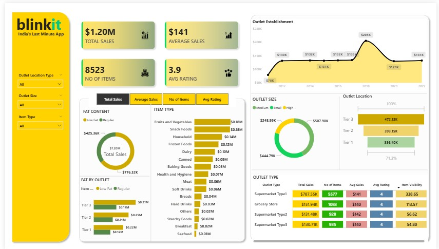

# 📊 Blinkit Sales Performance Dashboard (Power BI)

## 📌 Project Overview  
The **Blinkit Sales Performance Dashboard** is a Power BI–based analytical report designed to visualize and evaluate retail sales performance across multiple business dimensions.  
This project highlights **operational KPIs, outlet performance, product category contribution, fat content segmentation, customer ratings, and establishment-year trends** to support decision-making.  

It is suitable for **business analytics learning, sales reporting practice, and retail BI dashboards.**

---

---

## 🛠️ Tools & Technologies Used
- Microsoft Power BI Desktop  
- DAX Measures  
- Data Modelling  
- Slicers & Filters  
- KPI Cards  
- Bar, Line, Donut & Table Visuals  

---

## 🖼 Dashboard Preview

---

## 📂 Dashboard Structure (Visual Breakdown)

### 1️⃣ KPI Summary Panel (Top Section)
- **Total Sales:** $1.20M  
- **Average Sales per Item:** $141  
- **No. of Items Sold:** 8,523  
- **Average Rating:** 3.9  
- Represents high-level retail performance for quick decision insights.

---

### 2️⃣ Item Type / Product Category Analysis
- Horizontal bar comparison for multiple product categories  
- Displays contribution of items like:
  - Fruits & Vegetables  
  - Snack Foods  
  - Household  
  - Frozen Foods  
  - Meat, Dairy, Baking, Soft Drinks, Hard Drinks, Seafood, Breakfast, Starchy Foods, etc.  
- Helps identify **top-performing revenue categories.**

---

### 3️⃣ Fat Content Contribution
- Donut + bar visual comparing:
  - **Low Fat vs Regular Fat products**
- Shows total share in overall revenue and quantity.  
- Useful for **product-mix optimization.**

---

### 4️⃣ Outlet Size Analysis
- Donut chart segmenting:
  - **Small, Medium, High-size outlets**
- Highlights which store format contributes maximum revenue.  

---

### 5️⃣ Outlet Location Tier Performance
- Tier-wise stacked bars:
  - **Tier 1, Tier 2, Tier 3**
- Analyzes location impact on sales and performance share.

---

### 6️⃣ Establishment Year Trends (Line Graph)
- Year-wise sales pattern from **2012–2022**
- Shows jumps in revenue trajectory at milestone years  
- Helps evaluate impact of **store expansion phase.**

---

### 7️⃣ Outlet Type Performance Table
- Consolidated matrix showing for each outlet type:
  - Total Sales
  - No. of Items
  - Avg Sales
  - Avg Rating
  - Item Visibility
- Gives clear benchmarking for **Supermarket Type 1, Type 2, Type 3, Grocery Store**, etc.

---

### 8️⃣ Interactive Slicers (Left Panel)
- **Outlet Location Type**
- **Outlet Size**
- **Item Type**
- Allows instant filtering and visual storytelling.

---

## 🔄 Analysis Workflow
1. Sales data loaded into Power BI  
2. Data cleaned and model established  
3. Calculated measures built using DAX  
4. Visuals added for KPI-driven storytelling  
5. Slicers enable dimensional drill interaction  
6. Dashboard reflects revenue, items, outlet behavior, and performance KPIs  

---

## 🎯 Key Features
- End-to-end **Power BI data visualization**
- Retail KPI monitoring  
- Category-wise revenue analysis  
- Outlet performance benchmarking  
- Year-based trend analytics  
- Clean UI with slicers for business navigation  

---

## 🚀 How to Use
1. Download the `.pbix` file from repository  
2. Open in **Power BI Desktop**  
3. Interact using slicers on left side  
4. Explore KPIs, charts, and tables  

---

## 📄 License
Free to use for learning and demonstration purposes.
